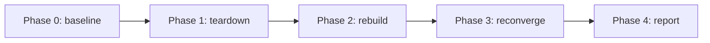

# Disaster recovery plan

How `aegis-stateless` recovers from failure, what it targets, and how that is
proven. This is the *plan*. The *evidence* from an actual drill run lands in
[`evidence/`](evidence/).

## Scope

This plan covers the **workload tier** — the greeter Deployment and the regional
infrastructure that hosts it (VPC, EKS, ALB, ArgoCD, the Alloy collector). It
does **not** cover the `platform` environment (Route 53 zone, ECR, OIDC roles,
Grafana dashboards): that is slow-lifecycle, survives a regional teardown by
design, and is outside the drill's blast radius.

## Service-level targets

| | Target | Notes |
|---|---|---|
| **RPO** | **~0 — not applicable** | The greeter is **stateless by design**. It holds no persistent data; there is nothing to lose and nothing to restore. RPO — the metric a stateful system fights for — is trivially satisfied here, and that is the point of the stateless architecture. |
| **RTO** (region rebuild) | **20–30 min** | Full single-region teardown → IaC re-apply → workload reconverged. Measured, not aspirational — breakdown below and [ADR-05](adr/05-disaster-recovery.md). |
| **SLI** | request success rate, request latency p95 | Emitted by the app over OpenTelemetry; the dashboard's RED panels. |
| **SLO** (posture) | 5xx rate < 5%, p95 latency < 1 s | The alert-rule thresholds in `platform/grafana.tf` are the SLO line — breaching them pages. |
| **SLA** | none committed | A take-home reference build, not a contracted service. The architecture's posture supports an SLA conversation; no number is promised. |

## Failure modes and recovery

Recovery is layered — the cheaper the failure, the faster and more automatic
the recovery.

| Failure | Detection | Recovery | RTO |
|---|---|---|---|
| **Pod dies** | kubelet liveness probe | Kubernetes recreates the pod from the Deployment | seconds |
| **Node dies** | node controller | The managed node group replaces the node; pods reschedule | ~2–5 min |
| **AZ impaired** | ALB health checks | Surviving AZs absorb traffic; the Deployment's replicas span AZs | seconds–minutes, no operator action |
| **Region lost** | operator / external monitoring | **The drill scenario** — rebuild the region from IaC; ArgoCD reconverges the workload from git | **20–30 min** |
| **Multi-region failover** | — | *Not implemented* — single region deployed. Pattern X makes a second region a one-line data change; failover would then be Route 53 latency records + health checks (~1–2 min). See [`tradeoffs.md`](tradeoffs.md). |

A single-region deployment means a region loss **is** a service outage until
the rebuild completes — the honest failure mode of a cost-bounded take-home.
It is documented, not hidden.

## The drill — region rebuild

The region-loss scenario is the one the drill exercises: it is the only failure
mode that needs the IaC + GitOps recovery path proven end to end. The
pod / node / AZ cases are Kubernetes and AWS doing their job — observable, but
not "recovered" by this repo's code.

### Procedure

`scripts/dr/dr-drill.sh <region>` sequences and times it:

| Phase | Action | Timed |
|---|---|---|
| 0 — baseline | Confirm the cluster is healthy: greeter pods Ready. Record T0. | — |
| 1 — teardown | `make destroy-region REGION=<region>` — VPC, EKS, ALB, ArgoCD, Alloy, workload destroyed. The greeter is now down. | T0 → T1 |
| 2 — rebuild | `make regional-one REGION=<region>` — Terraform re-applies the regional stack. | T1 → T2 |
| 3 — reconverge | ArgoCD reinstalls, pulls this repo, syncs the greeter from `k8s/overlays/prod/`. Poll until pods Ready. | T2 → T3 |
| 4 — report | Compute per-phase durations and total RTO (T3 − T1); write the report to `evidence/`. | — |

`make destroy-region` is destructive — the script requires explicit
confirmation before Phase 1.

### Measured RTO breakdown

EKS control-plane provisioning ~15 min · managed node group + addons (CNI,
CoreDNS, kube-proxy) ~5 min · ALB target health + DNS propagation ~1–3 min ·
ArgoCD sync ~30 s. The 20–30 min total is dominated by EKS cold-provisioning —
a fixed AWS cost, not something this repo can optimise. See
[ADR-05](adr/05-disaster-recovery.md).

## Validation — evidence

A drill run is a claim until it is evidenced. `dr-drill.sh` writes a report and
a CLI log to [`evidence/`](evidence/). The operator pairs it with a Grafana
dashboard screenshot of the drill window.

The screenshot must be **committed into git** — the live dashboard is not
durable evidence: the cluster is torn down after the demo, and Grafana Cloud's
free tier retains data only ~14 days, so a reviewer opening the submission later
would see nothing. The evidence directory keeps the proof self-contained.
